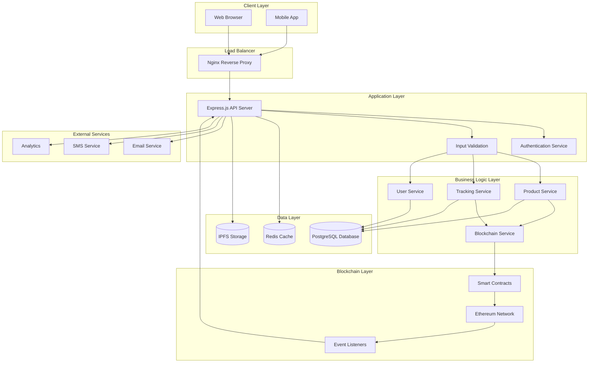

# System Architecture

This document provides a comprehensive overview of the Blockchain Logistics Traceability system architecture.

## Table of Contents

- [System Overview](#system-overview)
- [Technology Stack](#technology-stack)
- [Architecture Diagram](#architecture-diagram)
- [Component Details](#component-details)
- [Data Flow](#data-flow)
- [Security Architecture](#security-architecture)
- [Deployment Architecture](#deployment-architecture)
- [Performance Considerations](#performance-considerations)
- [Scalability](#scalability)

## System Overview

The Blockchain Logistics Traceability system is a full-stack web application that enables transparent tracking of products through supply chains using blockchain technology. The system consists of:

- **Frontend**: React-based web application
- **Backend**: Node.js/Express RESTful API
- **Blockchain**: Ethereum smart contracts
- **Database**: PostgreSQL for off-chain data
- **Infrastructure**: Docker containerization with Nginx

### Core Principles
- **Transparency**: All supply chain events are recorded on blockchain
- **Immutability**: Historical records cannot be altered
- **Decentralization**: No single point of failure
- **Scalability**: Support for high transaction volumes
- **Security**: Enterprise-grade security measures

## Technology Stack

### Frontend
```
React v18.x
├── Material-UI / Tailwind CSS (UI Framework)
├── Web3.js / Ethers.js (Blockchain Interaction)
├── React Router (Navigation)
├── Redux Toolkit (State Management)
├── Axios (HTTP Client)
└── React Query (Data Fetching)
```

### Backend
```
Node.js v18.x
├── Express.js (Web Framework)
├── Sequelize (ORM)
├── PostgreSQL (Database)
├── JWT (Authentication)
├── Express Validator (Input Validation)
├── Winston (Logging)
├── Jest (Testing)
└── Swagger (API Documentation)
```

### Blockchain
```
Ethereum Ecosystem
├── Solidity ^0.8.0 (Smart Contracts)
├── Hardhat (Development Framework)
├── OpenZeppelin (Security Libraries)
├── Web3.js (Blockchain Interaction)
└── IPFS (Distributed Storage)
```

### Infrastructure
```
Container Platform
├── Docker (Containerization)
├── Docker Compose (Multi-container)
├── Nginx (Reverse Proxy)
├── PostgreSQL (Database)
└── Redis (Caching - Future)
```

## Architecture Diagram



## Component Details

### Frontend Components

#### User Interface Layer
```
src/
├── components/          # Reusable UI components
│   ├── common/         # Generic components
│   ├── forms/          # Form components
│   └── charts/         # Data visualization
├── pages/              # Page components
│   ├── Dashboard/      # Main dashboard
│   ├── Products/       # Product management
│   ├── Tracking/       # Tracking interface
│   └── Reports/        # Analytics and reports
├── hooks/              # Custom React hooks
├── utils/              # Utility functions
├── store/              # Redux store
└── services/           # API service calls
```

#### State Management
- **Redux Toolkit**: Centralized state management
- **React Query**: Server state and caching
- **Local Storage**: Persistent user preferences
- **Session Storage**: Temporary data

### Backend Components

#### API Layer
```
src/
├── controllers/        # Request handlers
│   ├── authController.js
│   ├── productController.js
│   ├── trackingController.js
│   └── userController.js
├── middleware/         # Express middleware
│   ├── auth.js        # Authentication
│   ├── validation.js  # Input validation
│   ├── logging.js     # Request logging
│   └── errorHandler.js
├── models/            # Database models
├── routes/            # API routes
├── services/          # Business logic
│   ├── blockchainService.js
│   ├── productService.js
│   └── trackingService.js
├── utils/             # Utility functions
└── config/            # Configuration files
```

#### Database Schema
```sql
-- Users table
users (
    id, email, password_hash, role, 
    created_at, updated_at
)

-- Products table
products (
    id, name, description, category,
    manufacturer_id, batch_number,
    blockchain_tx_hash, created_at
)

-- Tracking Events table
tracking_events (
    id, product_id, event_type, location,
    timestamp, blockchain_tx_hash,
    metadata, created_at
)

-- Supply Chain Participants table
participants (
    id, name, type, address,
    verified, created_at
)
```

### Smart Contract Architecture

#### Contract Structure
```solidity
// ProductRegistry.sol
contract ProductRegistry {
    struct Product {
        uint256 id;
        string name;
        address manufacturer;
        uint256 timestamp;
        bool exists;
    }
    
    mapping(uint256 => Product) public products;
    mapping(uint256 => TrackingEvent[]) public productHistory;
    
    event ProductRegistered(uint256 indexed productId, address manufacturer);
    event TrackingEventAdded(uint256 indexed productId, string eventType);
}

// TrackingContract.sol
contract TrackingContract {
    struct TrackingEvent {
        string eventType;
        string location;
        uint256 timestamp;
        address recorder;
        string metadata;
    }
    
    function addTrackingEvent(uint256 productId, TrackingEvent memory event) external;
    function getProductHistory(uint256 productId) external view returns (TrackingEvent[] memory);
}

// AccessControl.sol
contract AccessControl {
    mapping(address => Role) public userRoles;
    
    enum Role { None, Viewer, Recorder, Admin }
    
    modifier onlyRole(Role requiredRole) {
        require(userRoles[msg.sender] >= requiredRole, "Insufficient permissions");
        _;
    }
}
```

## Data Flow

### Product Registration Flow
```
1. User Input → Frontend Validation
2. Frontend → Backend API
3. Backend → Database (Save draft)
4. Backend → Smart Contract (Register product)
5. Smart Contract → Blockchain Network
6. Event Listener → Update Database
7. Response → Frontend → User
```

### Tracking Event Flow
```
1. Tracking Event → Frontend
2. Frontend → Backend API
3. Backend → Validation & Authentication
4. Backend → Smart Contract (Add event)
5. Smart Contract → Emit Event
6. Event Listener → Database Update
7. Real-time → Frontend Notification
```

### Query Flow
```
1. User Request → Frontend
2. Frontend → Backend API
3. Backend → Database (Off-chain data)
4. Backend → Smart Contract (On-chain verification)
5. Data Aggregation → Response
6. Frontend → Data Visualization
```

## Security Architecture

### Authentication & Authorization
- **JWT Tokens**: Stateless authentication
- **Role-based Access Control**: Granular permissions
- **Multi-factor Authentication**: Enhanced security
- **Session Management**: Secure session handling

### Data Security
- **Input Validation**: Comprehensive sanitization
- **SQL Injection Prevention**: Parameterized queries
- **XSS Protection**: Content Security Policy
- **CSRF Protection**: Token-based validation

### Blockchain Security
- **Smart Contract Audits**: Professional security reviews
- **Access Controls**: Role-based contract permissions
- **Reentrancy Guards**: Protection against attacks
- **Gas Limit Controls**: Prevent DoS attacks

### Infrastructure Security
- **HTTPS Enforcement**: SSL/TLS encryption
- **Environment Variables**: Secure configuration
- **Container Security**: Minimal attack surface
- **Network Isolation**: Segmented networking

## Deployment Architecture

### Development Environment
```yaml
version: '3.8'
services:
  frontend:
    build: ./front-end
    ports: ["3000:3000"]
    environment:
      - NODE_ENV=development
      - REACT_APP_API_URL=http://localhost:5000

  backend:
    build: ./back-end
    ports: ["5000:5000"]
    environment:
      - NODE_ENV=development
      - DATABASE_URL=postgresql://user:pass@db:5432/logistics
    depends_on: [db]

  db:
    image: postgres:13
    environment:
      POSTGRES_DB: logistics
      POSTGRES_USER: user
      POSTGRES_PASSWORD: password
    volumes:
      - postgres_data:/var/lib/postgresql/data

  nginx:
    image: nginx:alpine
    ports: ["80:80"]
    volumes:
      - ./nginx.conf:/etc/nginx/nginx.conf
    depends_on: [frontend, backend]
```

### Production Environment
- **Container Orchestration**: Kubernetes/Docker Swarm
- **Load Balancing**: Multiple API instances
- **Database**: Managed PostgreSQL service
- **CDN**: Static asset delivery
- **Monitoring**: Application and infrastructure monitoring

## Performance Considerations

### Database Optimization
- **Indexing Strategy**: Optimized queries
- **Connection Pooling**: Efficient connections
- **Query Optimization**: Analyzed query plans
- **Read Replicas**: Scaled read operations

### Caching Strategy
- **Redis Cache**: Frequently accessed data
- **Browser Caching**: Static assets
- **API Response Caching**: Reduced latency
- **Database Query Caching**: ORM-level caching

### Blockchain Optimization
- **Gas Optimization**: Efficient contract code
- **Batch Transactions**: Reduced costs
- **Event Indexing**: Fast event queries
- **Layer 2 Solutions**: Scalability improvements

### Frontend Optimization
- **Code Splitting**: Lazy loading
- **Bundle Optimization**: Tree shaking
- **Image Optimization**: Compressed assets
- **Progressive Web App**: Enhanced performance

## Scalability

### Horizontal Scaling
- **Microservices Architecture**: Service separation
- **Container Orchestration**: Auto-scaling
- **Load Balancers**: Traffic distribution
- **Database Sharding**: Data partitioning

### Vertical Scaling
- **Resource Optimization**: CPU/Memory tuning
- **Database Optimization**: Performance tuning
- **Caching Layers**: Memory utilization
- **Network Optimization**: Bandwidth efficiency

### Blockchain Scalability
- **Layer 2 Integration**: Polygon, Arbitrum
- **State Channels**: Off-chain processing
- **Sidechains**: Parallel processing
- **Interoperability**: Multi-chain support

## Monitoring & Observability

### Application Monitoring
- **Metrics Collection**: Custom metrics
- **Log Aggregation**: Centralized logging
- **Error Tracking**: Real-time alerts
- **Performance Monitoring**: Response times

### Infrastructure Monitoring
- **Resource Utilization**: CPU, Memory, Disk
- **Network Monitoring**: Bandwidth, Latency
- **Container Health**: Status monitoring
- **Database Performance**: Query analysis

### Blockchain Monitoring
- **Transaction Monitoring**: Success rates
- **Gas Usage Tracking**: Cost optimization
- **Event Processing**: Real-time events
- **Network Health**: Node status

---

This architecture document is maintained by the development team and updated with major system changes. 