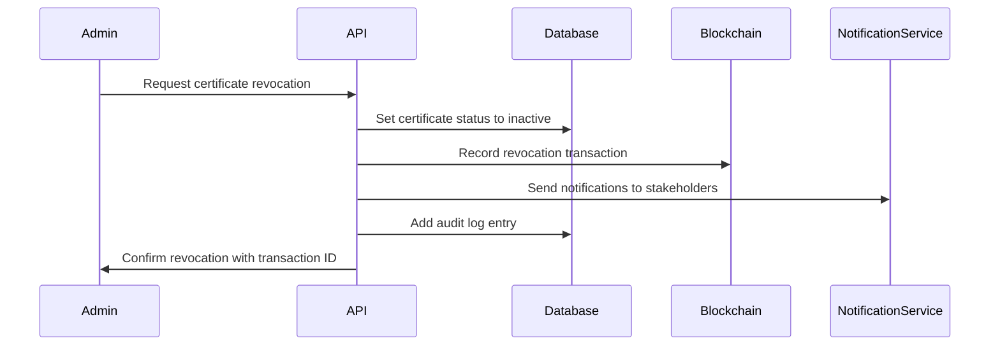

# Certificate Revocation Logic

This document outlines the business logic for certificate revocation in the TracePost-larvaeChain system.

## Overview

When a certificate is revoked through the admin API, several actions are triggered:

1. The certificate document status is changed to `inactive` in the database
2. A blockchain transaction is created to record the revocation
3. A notification is sent to relevant stakeholders
4. The revocation is recorded in the system audit log

## Certificate Revocation Flow

## Impact of Revocation

When a certificate is revoked:

1. The certificate can no longer be used for validation
2. Batches associated with the certificate may need review
3. The hatchery/entity associated with the certificate may need additional inspection
4. Export/import processes using the certificate are halted
5. QR codes scanning will display the certificate as "REVOKED"

## Implementation Details

The revocation blockchain transaction includes:

- Certificate ID
- Revocation reason
- Timestamp
- Revoking authority
- Digital signature

This information is permanently recorded on the blockchain and cannot be altered, ensuring transparency and accountability in the revocation process.

## Restoration Process

If a certificate needs to be restored after revocation (in rare cases):

1. A new certificate must be issued
2. The old certificate remains revoked
3. A link is created between the old and new certificates in the system
4. The restoration action is also recorded on the blockchain

This maintains the integrity of the revocation system while allowing for administrative corrections when necessary.
