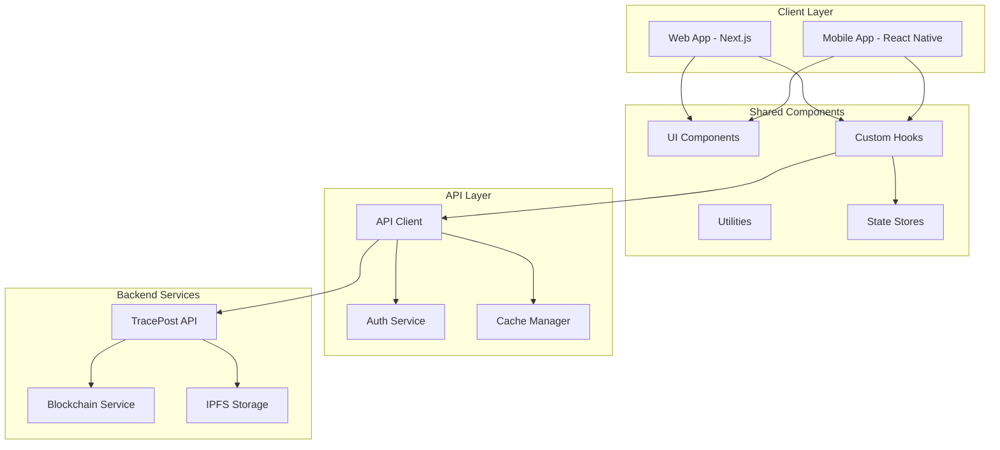

# 🌐 TracePost-LarvaeChain Frontend

[](https://nextjs.org/)
[](https://reactnative.dev/)
[](https://www.typescriptlang.org/)
[](https://tailwindcss.com/)
[](#)

## 📋 Table of Contents

- [Overview](#-overview)
- [Technology Stack](#-technology-stack)
- [Architecture](#-architecture)
- [Project Structure](#-project-structure)
- [Getting Started](#-getting-started)
- [Web Application](#-web-application)
- [Mobile Application](#-mobile-application)
- [Features](#-features)
- [Configuration](#-configuration)
- [Deployment](#-deployment)
- [Testing](#-testing)
- [Contributing](#-contributing)

## 🎯 Overview

The **TracePost-LarvaeChain Frontend** comprises enterprise-grade web and mobile applications built with modern technologies for blockchain-based supply chain traceability. Our applications provide intuitive interfaces for managing shrimp larvae traceability from hatchery to consumer.

### Mission Statement

To deliver seamless, user-friendly interfaces that make blockchain-based supply chain traceability accessible to all stakeholders in the aquaculture industry.

### Key Objectives

- **🎨 Modern UI/UX**: Intuitive and responsive design across all devices
- **⚡ High Performance**: Optimized for fast loading and smooth interactions
- **🔒 Secure Access**: Enterprise-grade security with role-based permissions
- **📱 Multi-Platform**: Native experiences on web and mobile platforms
- **🌍 Global Accessibility**: Multi-language support and accessibility compliance

## 🛠️ Technology Stack

### Core Technologies

| Platform | Technology | Version | Purpose |
|----------|------------|---------|---------|
| **Web Framework** |  | 14+ | Full-stack React framework |
| **Mobile Framework** |  | 0.72+ | Cross-platform mobile development |
| **Language** |  | 5.0+ | Type-safe development |
| **Styling** |  | 3.4+ | Utility-first styling |
| **State Management** |  | 4.4+ | Lightweight state management |

### Development Tools

| Tool | Purpose | Version |
|------|---------|---------|
| **Package Manager** | pnpm | 8.0+ |
| **Build Tool** | Vite/Metro | Latest |
| **Code Quality** | ESLint + Prettier | Latest |
| **Testing** | Jest + Testing Library | Latest |
| **CI/CD** | GitHub Actions | Latest |

## 🏗️ Architecture

### Application Architecture



### Design Principles

- **Component-Driven Development**: Reusable, modular components
- **Mobile-First Design**: Responsive design starting from mobile
- **Progressive Enhancement**: Enhanced features for capable devices
- **Accessibility-First**: WCAG 2.1 AA compliance
- **Performance-Optimized**: Code splitting and lazy loading

## 📂 Project Structure

```
front-end/
├── 📁 web/                          # Next.js Web Application
│   ├── 📁 src/
│   │   ├── 📁 app/                  # App Router (Next.js 13+)
│   │   │   ├── 📁 (auth)/           # Authentication pages
│   │   │   │   ├── login/           # Login page
│   │   │   │   └── register/        # Registration page
│   │   │   ├── 📁 (dashboard)/      # Dashboard pages
│   │   │   │   ├── batches/         # Batch management
│   │   │   │   ├── analytics/       # Analytics dashboard
│   │   │   │   ├── identity/        # Identity management
│   │   │   │   └── nft/             # NFT management
│   │   │   ├── 📁 (public)/         # Public pages
│   │   │   │   ├── trace/           # Traceability lookup
│   │   │   │   └── verify/          # Product verification
│   │   │   ├── layout.tsx           # Root layout
│   │   │   ├── page.tsx             # Home page
│   │   │   └── globals.css          # Global styles
│   │   ├── 📁 components/           # Reusable components
│   │   │   ├── 📁 ui/               # Base UI components
│   │   │   │   ├── button.tsx       # Button component
│   │   │   │   ├── input.tsx        # Input component
│   │   │   │   ├── modal.tsx        # Modal component
│   │   │   │   └── index.ts         # Component exports
│   │   │   ├── 📁 forms/            # Form components
│   │   │   │   ├── batch-form.tsx   # Batch creation form
│   │   │   │   ├── identity-form.tsx # Identity form
│   │   │   │   └── index.ts         # Form exports
│   │   │   ├── 📁 charts/           # Chart components
│   │   │   │   ├── analytics-chart.tsx
│   │   │   │   ├── performance-chart.tsx
│   │   │   │   └── index.ts
│   │   │   └── 📁 layout/           # Layout components
│   │   │       ├── header.tsx       # Application header
│   │   │       ├── sidebar.tsx      # Navigation sidebar
│   │   │       ├── footer.tsx       # Application footer
│   │   │       └── index.ts
│   │   ├── 📁 hooks/                # Custom React hooks
│   │   │   ├── use-auth.ts          # Authentication hook
│   │   │   ├── use-api.ts           # API integration hook
│   │   │   ├── use-batches.ts       # Batch management hook
│   │   │   ├── use-identity.ts      # Identity management hook
│   │   │   └── index.ts
│   │   ├── 📁 lib/                  # Library code
│   │   │   ├── api.ts               # API client
│   │   │   ├── auth.ts              # Authentication utilities
│   │   │   ├── constants.ts         # Application constants
│   │   │   ├── utils.ts             # Utility functions
│   │   │   └── validations.ts       # Form validation schemas
│   │   ├── 📁 stores/               # State management
│   │   │   ├── auth-store.ts        # Authentication state
│   │   │   ├── batch-store.ts       # Batch management state
│   │   │   ├── ui-store.ts          # UI state
│   │   │   └── index.ts
│   │   ├── 📁 styles/               # Styling
│   │   │   ├── globals.css          # Global CSS
│   │   │   ├── components.css       # Component styles
│   │   │   └── utilities.css        # Utility classes
│   │   └── 📁 types/                # TypeScript type definitions
│   │       ├── api.ts               # API response types
│   │       ├── auth.ts              # Authentication types
│   │       ├── batch.ts             # Batch-related types
│   │       └── index.ts
│   ├── 📁 public/                   # Static assets
│   │   ├── 📁 images/               # Image assets
│   │   ├── 📁 icons/                # Icon assets
│   │   ├── favicon.ico              # Favicon
│   │   └── manifest.json            # Web app manifest
│   ├── 📄 package.json              # Dependencies
│   ├── 📄 next.config.js            # Next.js configuration
│   ├── 📄 tailwind.config.js        # Tailwind CSS configuration
│   ├── 📄 tsconfig.json             # TypeScript configuration
│   └── 📄 .env.local                # Environment variables
├── 📁 app/                          # React Native Mobile Application
│   ├── 📁 src/
│   │   ├── 📁 components/           # Mobile components
│   │   │   ├── 📁 common/           # Common components
│   │   │   ├── 📁 forms/            # Form components
│   │   │   ├── 📁 navigation/       # Navigation components
│   │   │   └── 📁 screens/          # Screen-specific components
│   │   ├── 📁 screens/              # Application screens
│   │   │   ├── 📁 auth/             # Authentication screens
│   │   │   ├── 📁 dashboard/        # Dashboard screens
│   │   │   ├── 📁 batches/          # Batch management screens
│   │   │   ├── 📁 scanner/          # QR code scanner screens
│   │   │   └── 📁 profile/          # User profile screens
│   │   ├── 📁 navigation/           # Navigation configuration
│   │   │   ├── app-navigator.tsx    # Main navigator
│   │   │   ├── auth-navigator.tsx   # Auth stack navigator
│   │   │   └── tab-navigator.tsx    # Tab navigator
│   │   ├── 📁 services/             # Services and API
│   │   │   ├── api.ts               # API client
│   │   │   ├── auth.ts              # Authentication service
│   │   │   ├── storage.ts           # Async storage service
│   │   │   └── notifications.ts     # Push notifications
│   │   ├── 📁 hooks/                # Custom hooks
│   │   ├── 📁 stores/               # State management
│   │   ├── 📁 utils/                # Utility functions
│   │   └── 📁 types/                # TypeScript types
│   ├── 📁 assets/                   # Mobile assets
│   │   ├── 📁 images/               # Image assets
│   │   ├── 📁 fonts/                # Custom fonts
│   │   └── 📁 icons/                # Icon assets
│   ├── 📄 package.json              # Dependencies
│   ├── 📄 app.json                  # Expo configuration
│   ├── 📄 babel.config.js           # Babel configuration
│   ├── 📄 metro.config.js           # Metro bundler config
│   └── 📄 tsconfig.json             # TypeScript configuration
├── 📁 shared/                       # Shared code between platforms
│   ├── 📁 components/               # Shared components
│   ├── 📁 hooks/                    # Shared hooks
│   ├── 📁 types/                    # Shared types
│   ├── 📁 utils/                    # Shared utilities
│   └── 📁 constants/                # Shared constants
└── 📄 README.md                     # This documentation
```

## 🚀 Getting Started

### System Requirements

| Requirement | Minimum | Recommended |
|-------------|---------|-------------|
| **Node.js** | 18.0+ | 20.0+ |
| **Package Manager** | pnpm 8.0+ | pnpm 8.15+ |
| **Memory** | 4GB RAM | 8GB+ RAM |
| **Storage** | 2GB free | 5GB+ free |

### Development Setup

#### 1. Clone Repository
```bash
git clone https://github.com/LTPPPP/TracePost-larvaeChain.git
cd TracePost-larvaeChain/front-end
```

#### 2. Install Dependencies
```bash
# Install web dependencies
cd web
pnpm install

# Install mobile dependencies
cd ../app
pnpm install
```

#### 3. Environment Configuration
```bash
# Web application
cd web
cp .env.example .env.local

# Mobile application
cd ../app
cp .env.example .env
```

#### 4. Start Development Servers
```bash
# Web development server
cd web
pnpm dev

# Mobile development server (in separate terminal)
cd app
pnpm start
```

## 🌐 Web Application

### Next.js Web Application Features

#### Core Features
- **🏠 Dashboard**: Comprehensive overview of supply chain metrics
- **📦 Batch Management**: Create, track, and manage shrimp larvae batches
- **🔍 Traceability**: Complete product journey visualization
- **👤 Identity Management**: DID and credential management
- **🎨 NFT Gallery**: Digital asset visualization and management
- **📊 Analytics**: Real-time insights and reporting

#### Technology Highlights
- **App Router**: Latest Next.js 13+ App Router for enhanced performance
- **Server Components**: Optimized server-side rendering
- **TypeScript**: Full type safety throughout the application
- **Tailwind CSS**: Utility-first styling with custom design system
- **Responsive Design**: Mobile-first approach with desktop optimization

### Development Commands

```bash
# Development server
pnpm dev                    # Start development server
pnpm build                  # Build for production
pnpm start                  # Start production server
pnpm lint                   # Run ESLint
pnpm type-check            # TypeScript type checking
pnpm test                  # Run tests
```

### Key Web Components

#### Authentication Components
```typescript
// components/auth/login-form.tsx
export const LoginForm = () => {
  const { login, isLoading } = useAuth();
  
  return (
    <form onSubmit={handleSubmit}>
      <Input type="email" placeholder="Email" />
      <Input type="password" placeholder="Password" />
      <Button loading={isLoading}>Sign In</Button>
    </form>
  );
};
```

#### Batch Management Components
```typescript
// components/batches/batch-card.tsx
interface BatchCardProps {
  batch: Batch;
  onSelect: (batch: Batch) => void;
}

export const BatchCard = ({ batch, onSelect }: BatchCardProps) => {
  return (
    <div className="border rounded-lg p-4 hover:shadow-lg transition-shadow">
      <h3 className="font-semibold">{batch.id}</h3>
      <p className="text-gray-600">{batch.species}</p>
      <Badge variant="success">{batch.status}</Badge>
    </div>
  );
};
```

## 📱 Mobile Application

### React Native Mobile App Features

#### Core Features
- **📱 Native Performance**: Optimized for iOS and Android
- **📷 QR Code Scanner**: Instant product verification
- **🔔 Push Notifications**: Real-time updates and alerts
- **📍 GPS Tracking**: Location-based features
- **💾 Offline Support**: Works without internet connection
- **🔐 Biometric Auth**: Fingerprint and face ID support

#### Platform Support
- **iOS**: iOS 13.0+ with React Native 0.72+
- **Android**: Android 8.0+ (API level 26+)
- **Cross-Platform**: Shared codebase with platform-specific optimizations

### Development Commands

```bash
# Development
pnpm start                  # Start Metro bundler
pnpm android               # Run on Android
pnpm ios                   # Run on iOS
pnpm build:android         # Build Android APK
pnpm build:ios             # Build iOS IPA

# Testing
pnpm test                  # Run tests
pnpm test:e2e              # Run end-to-end tests
pnpm lint                  # Run ESLint
```

### Key Mobile Components

#### Scanner Component
```typescript
// components/scanner/qr-scanner.tsx
export const QRScanner = () => {
  const [hasPermission, setHasPermission] = useState<boolean | null>(null);
  const [scanned, setScanned] = useState(false);

  const handleBarCodeScanned = ({ type, data }) => {
    setScanned(true);
    // Process scanned QR code
    processQRCode(data);
  };

  return (
    <Camera
      onBarCodeScanned={scanned ? undefined : handleBarCodeScanned}
      style={StyleSheet.absoluteFillObject}
    />
  );
};
```

#### Navigation Structure
```typescript
// navigation/app-navigator.tsx
export const AppNavigator = () => {
  const { isAuthenticated } = useAuth();

  return (
    <NavigationContainer>
      {isAuthenticated ? (
        <Tab.Navigator>
          <Tab.Screen name="Dashboard" component={DashboardScreen} />
          <Tab.Screen name="Batches" component={BatchesScreen} />
          <Tab.Screen name="Scanner" component={ScannerScreen} />
          <Tab.Screen name="Profile" component={ProfileScreen} />
        </Tab.Navigator>
      ) : (
        <AuthNavigator />
      )}
    </NavigationContainer>
  );
};
```

## ✨ Features

### Authentication & Security
- **Multi-Factor Authentication**: TOTP and biometric support
- **Role-Based Access**: Granular permissions based on user roles
- **Session Management**: Secure token handling and refresh
- **DID Integration**: Decentralized identity verification

### Batch Management
- **Create Batches**: Intuitive batch creation workflow
- **Track Progress**: Real-time status updates and monitoring
- **Environmental Data**: IoT sensor data visualization
- **Quality Scoring**: Automated quality assessment display

### Traceability Features
- **Complete Journey**: Full supply chain visualization
- **QR Code Integration**: Instant product verification
- **Document Verification**: Certificate and license validation
- **Blockchain Verification**: Immutable record confirmation

### Analytics & Reporting
- **Real-time Dashboards**: Live performance metrics
- **Custom Reports**: Exportable analytics reports
- **Predictive Insights**: AI-powered predictions
- **Compliance Monitoring**: Regulatory compliance tracking

### NFT Management
- **Digital Assets**: NFT gallery and management
- **Tokenization**: Convert batches to digital assets
- **Transfer Tracking**: Ownership change monitoring
- **Metadata Management**: Rich asset information display

## ⚙️ Configuration

### Environment Variables

#### Web Application (.env.local)
```bash
# API Configuration
NEXT_PUBLIC_API_URL=https://api.tracepost.com
NEXT_PUBLIC_API_VERSION=v1

# Authentication
NEXT_PUBLIC_AUTH_DOMAIN=auth.tracepost.com
NEXT_PUBLIC_CLIENT_ID=your_client_id

# Blockchain
NEXT_PUBLIC_BLOCKCHAIN_RPC=https://rpc.tracepost.com
NEXT_PUBLIC_NETWORK_ID=tracepost-mainnet

# Analytics
NEXT_PUBLIC_ANALYTICS_ID=your_analytics_id

# Feature Flags
NEXT_PUBLIC_ENABLE_NFT=true
NEXT_PUBLIC_ENABLE_ANALYTICS=true
```

#### Mobile Application (.env)
```bash
# API Configuration
API_URL=https://api.tracepost.com
API_VERSION=v1

# App Configuration
APP_NAME=TracePost
APP_VERSION=1.0.0
BUNDLE_ID=com.tracepost.mobile

# Push Notifications
EXPO_PUSH_TOKEN=your_expo_push_token
FCM_SERVER_KEY=your_fcm_server_key

# Camera Permissions
CAMERA_PERMISSION_MESSAGE=Camera access required for QR scanning
```

### Tailwind Configuration

```javascript
// tailwind.config.js
module.exports = {
  content: ['./src/**/*.{js,ts,jsx,tsx}'],
  theme: {
    extend: {
      colors: {
        primary: {
          50: '#eff6ff',
          500: '#3b82f6',
          900: '#1e3a8a',
        },
        secondary: {
          50: '#f0fdf4',
          500: '#22c55e',
          900: '#14532d',
        },
      },
      fontFamily: {
        sans: ['Inter', 'sans-serif'],
        mono: ['JetBrains Mono', 'monospace'],
      },
    },
  },
  plugins: [
    require('@tailwindcss/forms'),
    require('@tailwindcss/typography'),
  ],
};
```

## 🚢 Deployment

### Web Application Deployment

#### Vercel (Recommended)
```bash
# Install Vercel CLI
npm i -g vercel

# Deploy to Vercel
cd web
vercel --prod
```

#### Docker Deployment
```dockerfile
# Dockerfile
FROM node:18-alpine AS builder
WORKDIR /app
COPY package*.json ./
RUN pnpm install
COPY . .
RUN pnpm build

FROM node:18-alpine AS runner
WORKDIR /app
COPY --from=builder /app/.next ./.next
COPY --from=builder /app/package.json ./
RUN pnpm install --production
EXPOSE 3000
CMD ["pnpm", "start"]
```

### Mobile Application Deployment

#### iOS App Store
```bash
# Build for iOS
cd app
npx eas build --platform ios --profile production

# Submit to App Store
npx eas submit --platform ios
```

#### Google Play Store
```bash
# Build for Android
cd app
npx eas build --platform android --profile production

# Submit to Play Store
npx eas submit --platform android
```

## 🧪 Testing

### Testing Strategy

#### Unit Testing
```bash
# Run unit tests
pnpm test

# Run with coverage
pnpm test:coverage

# Watch mode
pnpm test:watch
```

#### Integration Testing
```bash
# Web integration tests
cd web
pnpm test:integration

# Mobile integration tests
cd app
pnpm test:integration
```

#### End-to-End Testing
```bash
# Web E2E tests (Playwright)
cd web
pnpm test:e2e

# Mobile E2E tests (Detox)
cd app
pnpm test:e2e:ios
pnpm test:e2e:android
```

### Test Coverage Goals

| Component Type | Coverage Target | Current |
|----------------|-----------------|---------|
| **Utilities** | 95%+ | 92% |
| **Components** | 85%+ | 88% |
| **Hooks** | 90%+ | 91% |
| **Services** | 95%+ | 94% |
| **Overall** | 90%+ | **90%** |

## 🤝 Contributing

### Development Workflow

1. **Fork the repository**
2. **Create feature branch**: `git checkout -b feature/amazing-feature`
3. **Install dependencies**: `pnpm install`
4. **Make changes and test**: `pnpm test`
5. **Commit changes**: `git commit -m 'feat: add amazing feature'`
6. **Push to branch**: `git push origin feature/amazing-feature`
7. **Create Pull Request**

### Code Standards

#### TypeScript Guidelines
- Use strict mode with comprehensive type annotations
- Prefer interfaces over types for object shapes
- Use proper generic constraints and utility types
- Implement proper error handling with Result types

#### Component Guidelines
- Use functional components with hooks
- Implement proper prop validation
- Follow atomic design principles
- Ensure accessibility compliance

#### Styling Guidelines
- Use Tailwind CSS utility classes
- Follow mobile-first responsive design
- Implement consistent spacing and typography
- Use semantic color tokens

---

<div align="center">

### 🎨 Beautiful Interfaces for Blockchain Traceability

[](https://demo.tracepost.com)
[](https://apps.apple.com/tracepost)

**Modern • Responsive • Accessible • Fast**

</div>
